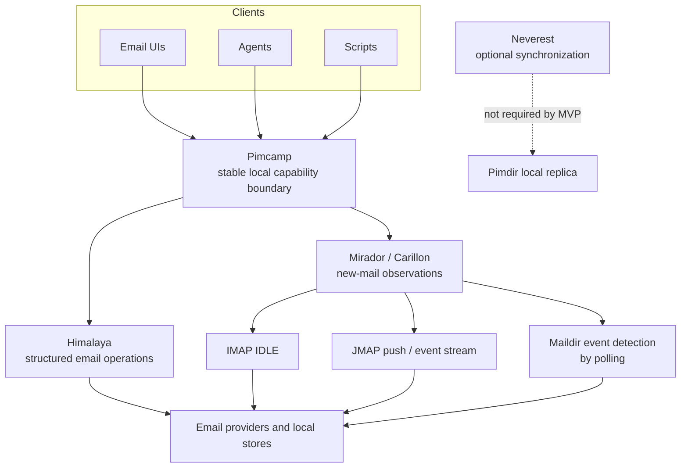

# Pimcamp

Pimcamp is a stable local email capability boundary for user interfaces,
agents, and scripts. It gives these clients one structured seam instead of
making them depend on a specific command-line tool, provider, or email
protocol.

Pimcamp is not an email app. It does not provide a mailbox user interface, a
sync engine, a search index, or a general email automation platform.

A generic account setup UI is included in this development tree and its installer;
it has not yet passed release acceptance. See the [onboarding design specification](docs/onboarding-ui-spec.md)
and [integration requirements](docs/onboarding-integration.md). This setup UI
configures the stack; mailbox viewers and composers remain independent clients.

The [design preview](ui/onboarding/index.html) can be opened directly from a
local checkout. It uses clearly labeled demo data and never connects or saves
an email account. Its [design notes](ui/onboarding/DESIGN.md) describe the screens
and integration boundary. Run `node tests/browser_onboarding.mjs ui/onboarding`
with Node and Chromium installed for the optional browser layout checks.

### Install the development candidate

Requires Linux and Python 3.12 or newer. From the checkout:

```sh
python3 scripts/install --version onboarding-candidate
~/.local/bin/pimcamp-setup
```

The installer includes the HTML/CSS, setup backend, and credential helpers. It
does not install dependencies, change account data, or overwrite an existing
release directory. Choose a new version name for a subsequent candidate.
Himalaya 2.1.0 and Carillon 0.1.0 must be installed separately; supply their
absolute paths with `--himalaya` and `--carillon` if they are not on PATH.

Setup opens an authenticated browser session on the fixed loopback port 33281.
IMAP & SMTP accepts your email address, editable server settings, and shared or
separate login credentials. Passwords go to an unlocked Secret Service keyring
through `secret-tool`, not into configuration files. A headless installation
also needs a working, unlocked Secret Service provider; installing the utility
alone does not provide one. No test email is sent during setup.

Google requires an installation-owned OAuth application and Ortie 2.2.0. Without
those prerequisites, the UI explains what is missing. See the
[integration notes](docs/onboarding-integration.md) for application options and
the remaining verification work. Opening the HTML file directly is only a demo;
use `pimcamp-setup` to configure a real account.

## Where Pimcamp fits



Pimcamp uses components from the Pimalaya ecosystem behind its boundary:

- [Himalaya](https://github.com/pimalaya/himalaya) provides structured email
  operations.
- [Mirador](https://github.com/pimalaya/mirador), now named Carillon, provides
  change observation through IMAP IDLE, a JMAP push/event stream, or Maildir
  event detection by polling.
- [Neverest](https://github.com/pimalaya/neverest) can synchronize email when
  a deployment needs a Pimdir local replica. Synchronization is optional and
  is not required by the MVP.

A future private adapter composition could place Maildir and notmuch beneath
the same Pimcamp boundary. That composition would reuse the existing public
capabilities. It is not part of the MVP and does not add a capability.

## MVP capabilities

The public MVP surface contains exactly seven capabilities:

1. `list` — list current message summaries.
2. `read` — retrieve the current form of a selected message.
3. `compose` — create a structured composition without sending it.
4. `reply` — create a structured reply from the current source message.
5. `send` — send a composition or reply.
6. `junk` — file a selected message as junk by the strongest supported method.
7. `subscribe_new_mail` — stream normalized new-mail observations so a client
   can retrieve authoritative state through Pimcamp.

Pimcamp is an independent project. It is not an official Pimalaya project and
is not affiliated with or endorsed by Pimalaya.

## Build authority

- Spec artifact: `art_4e44121c`
- Canonical spec commit: `bf8c76f8879184bb5dadcb23d7930d7e3ecbb509`
- Spec SHA-256: `05ba0b738f9cac4413c7bf859f9ba92b2319ffe0368906f68b261e211b44983b`
- Independent reviewed-clean verdict: `att_c06fccb3`
- Review report: `art_89006412`

The reviewed specification is the product authority. A ruled amendment for
truthful Mirador startup semantics is present at tightbeam-specs commit
`c898bd4e91b7d8b6f92f2ef421d7845e6868f2be`, artifact `art_8bc4f300`, SHA-256
`cda69c3763eb5e03efaa577686af196bd6a955b13ab9aa672bb1e16d37a7f542`.
Its independent reviewed-clean verdict is
`att_03f441dc-474f-47f5-9e0d-ce773d45146a`; its clause report is
`art_df06241c`, SHA-256
`0ef89997f2d334ca36754fffef89430d94f167b2f0d75fb610b12375e464d2a8`.

## Runtime

Pimcamp requires Linux, Python 3.12 or later, and an owner-only deployment
configuration. The repository-local executable is `./pimcamp`.

Finite calls read one request value from standard input, write one JSON line to
standard output, and exit with status 0 or 1. A subscription keeps standard
output open for normalized event lines and closes its lower process on client
`SIGTERM`.

The default configuration path is
`$XDG_CONFIG_HOME/pimcamp/config.json`, or
`~/.config/pimcamp/config.json` when `XDG_CONFIG_HOME` is absent. Deployment
may set `PIMCAMP_CONFIG` before it launches the client process. The
configuration file, the state directory, the SQLite state file, and mutation
lock files must be owner-only.

The real operations adapter targets Himalaya 2.1.0 source commit
`bbdfb09b8b8841a509df463a80066531fb81af04` and its locked
`pimalaya-cli 0.2.4` JSON printer. Its configuration has this closed shape:

```json
{
  "credentials": {
    "<sha256-of-high-entropy-client-credential>": {
      "client_identity": "local-client",
      "grants": ["list", "read", "compose", "reply", "send", "junk", "subscribe_new_mail"]
    }
  },
  "adapter_wait_seconds": 10,
  "state_path": "/private/pimcamp/state.sqlite3",
  "operations_adapter": {
    "kind": "himalaya",
    "executable": "/usr/bin/himalaya",
    "account": "personal",
    "config_paths": ["/private/himalaya/config.toml"],
    "inbox": "INBOX",
    "junk_mailbox": "Junk",
    "from": {"name": "Sender", "address": "sender@example.test"}
  },
  "observation_adapter": {
    "kind": "mirador",
    "executable": "/usr/bin/carillon",
    "account": "personal",
    "backend": "imap",
    "config_paths": ["/private/carillon/config.toml"]
  }
}
```

The Himalaya adapter uses explicit SMTP envelope recipients. It does not place
`Bcc` in the RFC 5322 headers. It reports `move_to_junk` only when deployment
positively configures `junk_mailbox`; current inspected Himalaya source provides
no proved spam-reporting call, so the adapter does not claim one.

The real observation adapter targets current Mirador/Carillon 0.1.0 source
commit `b431f9f793eecdb6e65cc5437318152a7def02c0`. Carillon reports arrivals
through configured hooks and exposes no post-open watch readiness event.
Pimcamp starts one Carillon execution with a private, owner-only overlay that
changes only that execution's `on-message-added` command. The command emits a
constant internal signal and copies no Carillon event field. Pimcamp returns
`{status: "started"}` after the execution starts. This result does not claim
that the backend watch is live; the first normalized event is the real watch
evidence. The selected backend must be `imap`, `jmap`, or `maildir`, and the
named Carillon account must configure that backend and its inbox collection.
Use a dedicated Carillon account configuration with no notification hook and
no hook other than `on-message-added`; Pimcamp rejects extra hooks so their
commands cannot share the private event pipe.

A finite invocation looks like this:

```sh
printf '%s' '{"contract_version":"pimcamp.v1","client_credential":"<secret>","input":{"limit":25}}' | ./pimcamp list
```

Do not place a real credential in shell history in normal use. Supply the
request through the calling program's private input path.

## Safety properties

- Authorization finishes before adapter I/O or mutation reservation.
- Message references and cursors are opaque Pimcamp values.
- List, read, reply-source lookup, and notification-triggered refresh use the
  current operations adapter. Notifications are hints, not mail truth.
- Send and junk reserve a durable receipt before one adapter attempt. A reused
  mutation ID replays its terminal result or returns `conflict`; ambiguity is
  recorded as `outcome_unknown` and never retried implicitly.
- One deployment-owned absolute deadline bounds all finite lower phases. A
  client `SIGTERM` starts a fresh observation teardown deadline.
- Public errors and ordinary diagnostics omit mail content, credentials, and
  raw lower material.

## Verification

Run the repository gate:

```sh
python3 -m compileall -q src tests pimcamp
python3 -m unittest discover -s tests -v
python3 -m unittest tests.test_process_boundary -v
```

The process suite runs the same inherited public contract checks against two
independent private-port pairs. These deterministic ports are not lower-adapter
fixtures and claim no Himalaya or Mirador syntax.

Run the credentialed journey separately:

```sh
python3 -m unittest tests.test_live_adapters -v
```

The live journey mutates the dedicated test account. A private runner must set
`PIMCAMP_LIVE_ENABLE=1`, `PIMCAMP_LIVE_CONFIG`,
`PIMCAMP_LIVE_CREDENTIAL`, `PIMCAMP_LIVE_RECIPIENT`,
`PIMCAMP_LIVE_HIMALAYA_VERSION`, and `PIMCAMP_LIVE_MIRADOR_VERSION`. The
recipient must automatically reply with the unique token. Do not put the
credential value in shell history.

An explicit local skip is honest but is not release evidence. Release evidence
requires the real journey to pass, real redacted captures, exact tool versions,
the selected junk mechanism, adapter-call counts, and the content-free
start/event/query ordering trace. See `tests/fixtures/README.md`.
