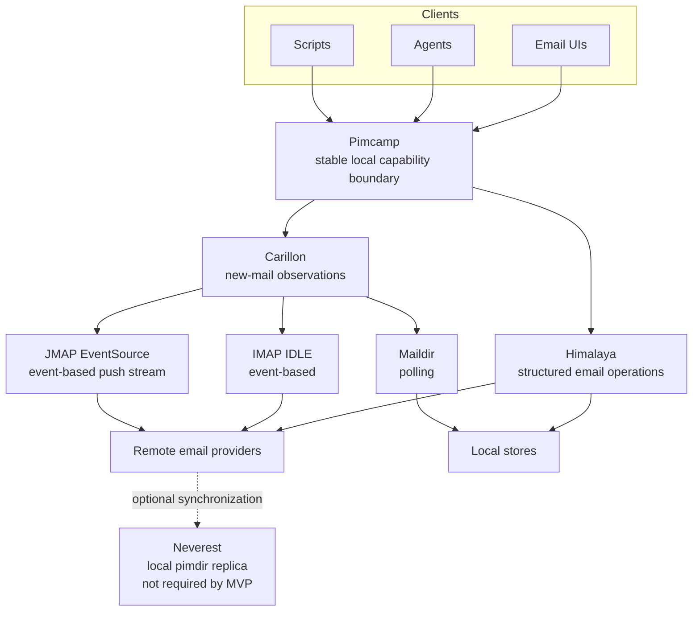

# Pimcamp

Pimcamp is a stable local email capability boundary for user interfaces,
agents, and scripts. It gives these clients one structured seam instead of
making them depend on a specific command-line tool, provider, or email
protocol.

Pimcamp is not an email app. It does not provide a user interface, a sync
engine, a search index, or a general email automation platform.

## Where Pimcamp fits

Pimcamp uses components from the Pimalaya ecosystem behind its boundary:

- [Himalaya](https://github.com/pimalaya/himalaya) provides structured email
  operations.
- [Carillon](https://github.com/pimalaya/carillon), formerly Mirador, provides
  event-based change observation through IMAP IDLE or a JMAP EventSource push
  stream. It observes Maildir through polling. The
  [historical Mirador link](https://github.com/pimalaya/mirador) redirects to
  Carillon.
- [Neverest](https://github.com/pimalaya/neverest) can synchronize remote
  sources into its local pimdir replica. Synchronization is optional and is
  not required by the MVP.

A future private adapter composition could place Maildir and notmuch beneath
the same Pimcamp boundary. That composition would reuse the existing public
capabilities. It is not part of the MVP and does not add a capability.

## MVP capabilities

The public MVP surface contains exactly seven capabilities:

1. `list` — list current message summaries.
2. `read` — retrieve the current form of a selected message.
3. `compose` — create a structured composition without sending it.
4. `reply` — create a structured reply from the current source message.
5. `send` — send a composition or reply.
6. `junk` — file a selected message as junk by the strongest supported method.
7. `subscribe_new_mail` — stream normalized new-mail observations so a client
   can retrieve authoritative state through Pimcamp.

Pimcamp is an independent project. It is not an official Pimalaya project and
is not affiliated with or endorsed by Pimalaya.

## Build authority

- Spec artifact: `art_4e44121c`
- Canonical spec commit: `bf8c76f8879184bb5dadcb23d7930d7e3ecbb509`
- Spec SHA-256: `05ba0b738f9cac4413c7bf859f9ba92b2319ffe0368906f68b261e211b44983b`
- Independent reviewed-clean verdict: `att_c06fccb3`
- Review report: `art_89006412`

The reviewed specification is the product authority.
